# Hundir la flota
- [Hundir la flota](#hundir-la-flota)
- [Autores](#autores)
- [Introducción](#introducción)
- [Documentación de usuario](#documentación-de-usuario)
  - [Descripción funcional](#descripción-funcional)
  - [Tecnología](#tecnología)
  - [Manual de instalación](#manual-de-instalación)
  - [Acceso al sistema](#acceso-al-sistema)
  - [Manual de Referencia](#manual-de-referencia)
  - [Guía del operador](#guía-del-operador)
- [Documentación del sistema](#documentación-del-sistema)
  - [Especificación del sistema](#especificación-del-sistema)
  - [Módulos](#módulos)
    - [Prueba de los módulos e integración](#prueba-de-los-módulos-e-integración)
    - [Plan de pruebas de aceptación](#plan-de-pruebas-de-aceptación)
- [Documentación del código fuente](#documentación-del-código-fuente)
- [Referencias {-}](#referencias--)


# Autores
- Alberto Cereceda Villar
- David Massa Gallego
- Santiago Brioso Ramírez
- Antonio José Ortega Sánchez

# Introducción

En este proyecto hemos realizado el mítico juego llamado "Hundir la flota" en el lenguaje de programación de C. Este programa de primeras pensamos dividirlo en 4 módulos diferentes:

- **Módulo interfaces**: Contamos con todos los menús disponibles del programa.
- **Módulo load**: Donde hacemos la carga y descarga de ficheros.
- **Módulo configuración**: Personalizamos todos los datos necesarios previamente a jugar la partida de Hundir la flota.
- **Módulo juego**: Finalmente contamos con el menú para jugar.

**NOTA**: Cabe destacar que se han implementado todas las restricciones que pensamos de primeras al hacer el primer desglose del proyecto, y se han añadido nuevas. 

<div style="page-break-after: always;"></div>

# Documentación de usuario

## Descripción funcional

El juego consta de 3 menús.
- Un **menú principal** en el cual podemos acceder tanto al **menú configuración** como al **menú juego**.
  - **Menú configuración** -> En este menú vamos a configurar todo lo necesario para poder disfrutar de una partida de Hundir la flota. Ya sea como el nombre de los jugadores, el número de barcos que vamos a usar, las dimensiones del tablero...
  - **Menú juego** -> En este menú podremos acceder al juego y disfrutar de una partida de Hundir la flota.


## Tecnología

Para realizar el proyecto hemos contado con dos softwares. Hemos usado tanto **visual studio code** para que sea nuestro entorno de programación y como compilador hemos usado **gcc**.
Por otra parte, para gestionar todo el proyecto hemos usado la plataforma de **GitHub**.

* [Visual Studio Code](https://code.visualstudio.com/)
* [GitHub](https://github.com)
* [gcc](https://packages.msys2.org/packages/mingw-w64-x86_64-gcc)

## Manual de instalación

Vamos a proceder a explicar qué hacer para poder jugar sin ningún tipo de problemas al "Hundir la flota", ya que como sabemos algunas veces el mismo compilador puede dar problemas dependiendo ocasionalmente del mismo sistema operativo.

Durante el proceso de la programación de dicho programa creamos un proyecto en **`visual studio code`**. Para dicha elaboración gestionamos el programa en diferentes carpetas y ficheros:

- Carpeta **src** -> Esta carpeta incluye todo el código fuente del programa de los diferentes módulos.
- Carpeta **include** -> Esta carpeta contiene todos los ficheros cabeceras de los diferentes módulos.
- Carpeta **vscode** -> En esta carpeta contamos con 3 archivos importantes para nuestra gestión.
  - Archivo **`settings.json`** -> Le decimos al compilador que trate los archivos cabecera como si fueran C para que los reconozca bien.
  - Archivo **`launch.json`** -> Este archivo configura el entorno de depuración del proyecto.
  - Archivo **`tasks.json`** -> Gracias a este archivo compilamos y ejecutamos todo el código fuente y las cabeceras.

Vamos a desglosar un poco el fichero tanto `launch.json` como `tasks.json` dado a que depende del SO puede variar un poco. Nos hemos centrado tanto en linux como en windows ya que interpretamos que son los sistemas operativos más usados por la mayoría de usuarios.

<div style="page-break-after: always;"></div>

**WINDOWS**

`launch.json`
```
{
  "version": "0.2.0",
  "configurations": [
    {
      "name": "Depurar Hundir la Flota",
      "type": "cppdbg",
      "request": "launch",
      "program": "${workspaceFolder}/MP/hundir_la_flota",
      "args": [],
      "stopAtEntry": false,
      "cwd": "${workspaceFolder}/MP",
      "environment": [],
      "externalConsole": true,
      "MIMode": "gdb",
      "miDebuggerPath": "C:/MinGW/bin/gdb.exe",
      "setupCommands": [
        {
          "description": "Enable pretty-printing for gdb",
          "text": "-enable-pretty-printing",
          "ignoreFailures": true
        },
        {
          "description": "Set Disassembly Flavor to Intel",
          "text": "-gdb-set disassembly-flavor intel",
          "ignoreFailures": true
        }
      ]
    },
    {
      "name": "C/C++ Runner: Debug Session",
      "type": "cppdbg",
      "request": "launch",
      "args": [],
      "stopAtEntry": false,
      "externalConsole": true,
      "cwd": "c:/Users/Usuario/Desktop/AntonioUni/MP/MP HundirFlota/TrabajoMP24-25",
      "program": "c:/Users/Usuario/Desktop/AntonioUni/MP/MP HundirFlota/TrabajoMP24-25/build/Debug/outDebug",
      "MIMode": "gdb",
      "miDebuggerPath": "gdb",
      "setupCommands": [
        {
          "description": "Enable pretty-printing for gdb",
          "text": "-enable-pretty-printing",
          "ignoreFailures": true
        }
      ]
    }
  ]
}
```

`tasks.json`
```
{
    "version": "2.0.0",
    "tasks": [
        {
            "label": "Compilar y ejecutar Hundir la Flota",
            "type": "shell",
            "command": "gcc src/*.c -o hundir_la_flota -I include; ./hundir_la_flota",
            "group": {
                "kind": "build",
                "isDefault": true
            },
            "problemMatcher": ["$gcc"]
        }
    ]
}
```

- Si quisiéramos compilar y ejecutar sin problemas en **Windows** tendríamos que acceder a la carpeta `.vscode` del proyecto y copiar esta configuración que hemos proporcionado para que no haya ningún error.

**Linux**

`launch.json`
```
{
    "version": "0.2.0",
    "configurations": [
        {
            "name": "Depurar Hundir la Flota",
            "type": "cppdbg",
            "request": "launch",
            "program": "${workspaceFolder}/MP/hundir_la_flota",
            "args": [],
            "stopAtEntry": false,
            "cwd": "${workspaceFolder}/MP",
            "environment": [],
            "externalConsole": true,
            "MIMode": "gdb",
            "miDebuggerPath": "/usr/bin/gdb", // CAMBIO: ruta del gdb en Linux
            "setupCommands": [
                {
                    "description": "Enable pretty-printing for gdb",
                    "text": "-enable-pretty-printing",
                    "ignoreFailures": true
                },
                {
                    "description": "Set Disassembly Flavor to Intel",
                    "text": "-gdb-set disassembly-flavor intel",
                    "ignoreFailures": true
                }
            ]
        }
    ]
}

```

`tasks.json`
```
{
    "version": "2.0.0",
    "tasks": [
        {
            "label": "Compilar y ejecutar Hundir la Flota",
            "type": "shell",
            "command": "gcc src/*.c -o hundir_la_flota -I include && ./hundir_la_flota",
            "group": {
                "kind": "build",
                "isDefault": true
            },
            "problemMatcher": ["$gcc"]
        }
    ]
}
```

- Si quisiéramos compilar y ejecutar sin problemas en **Linux** tendríamos que acceder a la carpeta `.vscode` del proyecto y copiar esta configuración que hemos proporcionado para que no haya ningún error.

**IMPORTANTE**

- Para poder hacer uso de nuestro programa es necesario el compilador que hemos usado mencionado ya unas cuantas veces `visual studio code`. Una vez que hayamos seguidos todos estos pasos simplemente tendríamos que presionar **`Ctrl + Shift + B`** y arrancará en proyecto entero. El proyecto que subiremos al campus estará con la configuración de **Windows** ya que es donde hicimos los retoques finales, hay que tener en cuenta esto para que no haya ningún fallo.

## Acceso al sistema

Contamos con unos menús bastantes intuitivos, hemos pensado que hacerlo así sería la manera más correcta para evitar todo tipo de errores. Gracias a esto, el programa es 100% funcional y no debería de ocasionar ningún problema.

- Contamos con el menú principal:

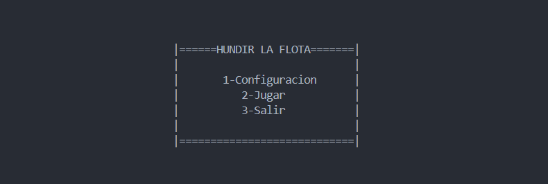

Aqui tenemos 3 opciones:

- **Menú configuración**: podemos acceder presionando "1".
- **Menú jugar**: podemos acceder presionando "2".
- **Salir**: podemos acceder presionando "3".

Si accedemos a uno de los menús mencionados, para poder salir del sistema simplemente tendremos que seleccionar una opción llamada "Volver" presionando el número con el que venga acompañado dicha opción. Una vez que estemos en el menú principal pues seleccionamos el dígito "3".

## Manual de Referencia

¿Qué beneficios puede obtener un usuario al hacer uso de nuestro programa?

Pensamos que fundamentalmente uno de los beneficios que puede obtener cualquier usuario al jugar con respecto a otros "Hundir la flota" es la automatización que hemos implementado la cual es totalmente funcional. Estamos ante la era de la inmediatez, el cual necesitamos estímulos inmediatos y no podemos dedicarle nada más que unos minutos a pensar.

Al final este juego es un poco de aleatoriedad, pero también estratégico, y posicionar los barcos de una manera u otra puede marcar la diferencia para poder ganar la partida. Gracias a nuestro sistema de automatización, podemos generar la posición de los barcos de manera aleatoria adaptándonos al tamaño del tablero que se haya configurado en cuestión.
Por otra parte en la configuración podemos elegir un sistema de tiro automático.

**Situaciones de error que contemplamos**

 1. Inconsistencia en el fichero `juego.txt`
- El tablero almacenado debe coincidir con:
  - El tamaño configurado.
  - El número de barcos en la flota.
  - Los tipos de barcos en los tableros.

2. Tamaño insuficiente de la flota
- El número de barcos debe ser **mayor o igual** que el número de tipos de barcos.
- Evitar configuraciones absurdas (ej: solo 3 submarinos en un tablero grande).

3. Errores en la colocación de barcos
- Primero seleccionar posición (vertical/horizontal).
- Luego elegir un punto inicial.
- Comprobar que todas las casillas necesarias estén libres.

4. Borrado de configuración inexistente
- Si no existe una configuración creada, mostrar mensaje:  
  **"No se ha creado una configuración"**.
- Al borrar una configuración existente, restaurar valores iniciales.

5. Guardado y carga de datos
- El sistema debe cargar el fichero `juego.txt` para inicializar todas las estructuras al iniciar.

6. Continuación de partidas
- No se permite continuar una partida desde `juego.txt`.
- Solo se puede cargar datos para iniciar una nueva partida.

En cualquier caso **todos** estos tipo de errores y algunos más, están solventados y si por algún casual el sistema por ejemplo no coge el número de barcos que quieres meter en un tablero porque lo excede se le notificará al usuario para que lo pueda volver a introducir.

## Guía del operador

Para poder disfrutar de una partida de "Hundir la Flota", primero tenemos que realizar su configuración accediendo pues a su menú pulsando el número "1" (del menú previamente enseñado).

- Menú configuración:

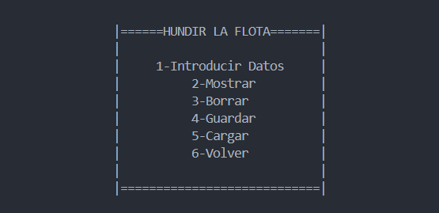

Una vez accedido a dicho menú procedemos a la configuración del juego pulsando nuevamente el dígito "1". Las demás opciones son simplemente para mostrar, borrar, guardar, cargar dichas configuraciones.

- Introducir Datos:

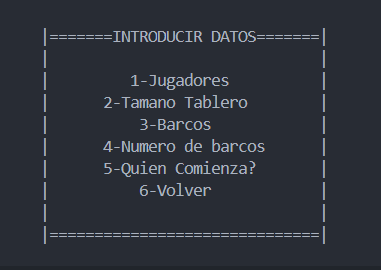

Vamos pulsando los números que corresponden para rellenar cada tipo de datos, el "1" para jugadores, el "2" para el tamaño del tablero así sucesivamente.

Una vez tenemos esto vamos al menú del juego, volviendo hacia atras al menú principal mostrado antes y una vez estando ahí presionando la tecla "2".

- Menú juego:

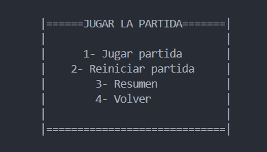

Simplemente para poder disfrutar del juego presionamos la tecla "1".
Al principio tendremos que elegir si queremos generar la posición de los barcos en el tablero de manera automática o de manera manual, y una vez hecho eso podremos empezar a jugar. Lo que veremos siempre será nuestro tablero con la posición de el/los barco/s, y la del tablero del oponente en donde ejecutaremos los disparos (bien de forma manual o automática eso se elige previamente en la configuración).

Ejemplo partida:
- Nuestro tablero:

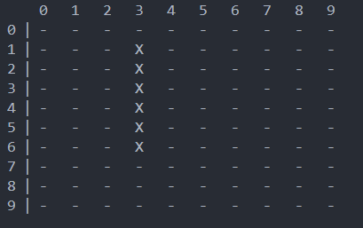

- Seguidamente saldrá el tablero del oponente:

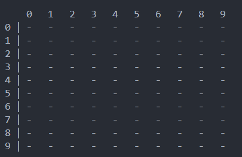


Conforme la partida avance, poco a poco el tablero oponente se irá modificando haciendonos ver si hay agua (*), si el barco está tocado (T) o si está hundido (H). La partida termirá cuando uno de los jugadores consiga hundir todos los barcos del oponente.

Ejemplo partida avanzada:

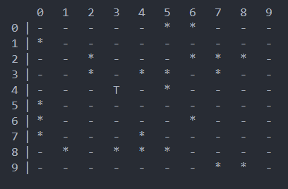


# Documentación del sistema

## Especificación del sistema

Durante el proyecto realizamos un esquema dónde se explica bastante bien como hemos hecho la descompisición del proyecto para que no hubiera ningún tipo de problema:

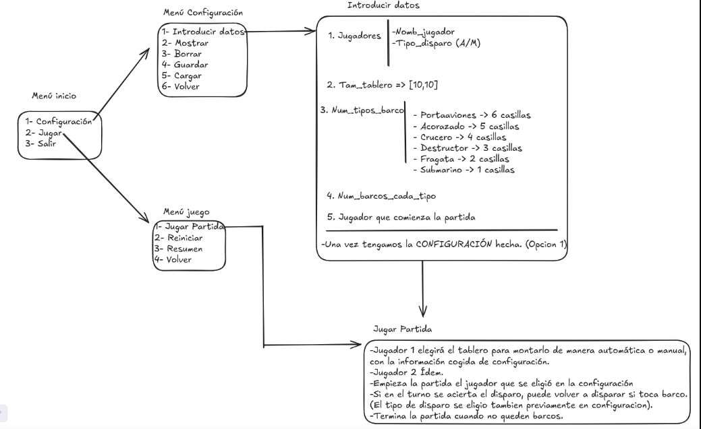


## Módulos

- Módulo **load** -> Este módulo se encarga de
guardar y cargar el estado del juego.
- Módulo **interfaces** -> Maneja la interacción con el usuario,
mostrando los tableros y recogiendo inputs.
- Módulo **configuración** -> Define la inicialización del juego,
como la elección de los diferentes tipos de barcos y los tamaños del
tablero.
- Módulo **juego** -> Contiene la lógica del juego,
incluyendo la gestión de turnos y los ataques. 

### Prueba de los módulos e integración

Vamos a realizar pruebas de caja blanca y caja negra a una función de cada uno de los módulos que hemos implementado.

**Módulo configuración**

- Procedimiento **introducir_tamano_tablero()**:
  - Prueba de caja blanca:
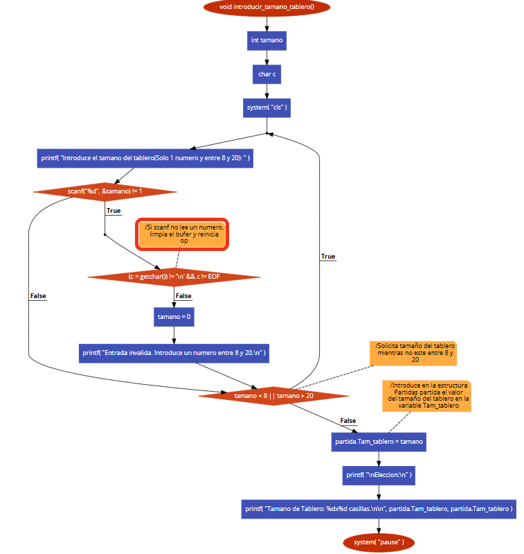
La complejidad por cualquier función viene dada por:
C = Nº aristas - nº nodos + 2
C = Nº nodos predicados + 1
Por lo tanto, en el caso de esta función:
C = 15 - 14 + 2 = 3
C = 2 + 1 = 3
Las rutas posibles son:

| Rutas | Secuencias de aristas |
--------|---------------|
| 1 | 1 → 2 → 3 → 4 → 5 → 6 → 7 → 8 → 9 → 10 |
| 2 | 	1 → 2 → 3 → 4 → 5 → 11 → 12 → 13 → 14 → 15 → 4 → 5 → 6 → 7 → 8 → 9 → 10 |
| 3 | 1 → 2 → 3 → 4 → 5 → 6 → 15 → 4 → 5 → 6 → 7 → 8 → 9 → 10 |

  - Prueba de caja negra:

Al iniciar el procedimiento ‘introducirtamanotablero’, se procede a inicializar dos variables locales. La primera es un entero ‘tamano’ que contendrá el tamaño seleccionado por el usuario, y la otra una variable de tipo char ‘c’ que utilizaremos más adelante para limpiar el buffer en caso de que el usuario ingrese un dato fuera de lugar.

Primero limpiamos la pantalla, y después viene la parte en la que los usuarios interactivamente eligen un número que representará el tamaño del tablero. Se entiende que el tamaño del tablero debe estar entre los 8 y los 20, ya que son las medidas más idóneas a fin de brindarnos una experiencia más agradable del juego.

Si la entrada no es un número válido, el scanf falla y no retorna un valor. En este caso, se limpia el buffer utilizando un bucle getchar() y se intenta mostrar un mensaje que indique a todo el mundo que realmente, la respuesta que se recibió no fue válida.

El bucle también se encarga de verificar la validez del número, es decir que esté entre 8 y 20. Si no se encuentra dentro de ese límite, se pide intencionalmente que el usuario introduzca un nuevo numero.

Una vez introducido un valor correcto, el programa asigna el tamaño validado a la variable Tam_tablero dentro de la estructura partida, asegurando así que el tablero tenga un tamaño válido para el resto del programa.

Por último, cuando se configura el tamaño del tablero se muestra un mensaje confirmando la dimensión del mismo.

**Módulo interfaces**

- Procedimiento **Menu_Juego()**:
  - Prueba de caja blanca:

<div style="text-align: center;">
  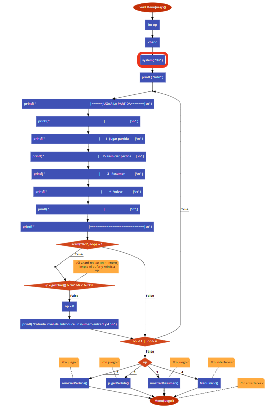
</div>

La complejidad por cualquier función viene dada por:
C = Nº aristas - nº nodos + 2
C = Nº nodos predicados + 1
Por lo tanto, en el caso de esta función:
C = 28 - 26 + 2 = 4
C = 3 + 1 = 4
Las rutas posibles son:

| Rutas | Secuencias de aristas |
--------|---------------|
| 1 | 1 → 2 → 3 → 4 → 5 → 6 → 7 → 8 → 9 → 10 → 11 → 12 → 13 → 22 → 16 → 17 → 18 → 19 → 24 |
| 2 | 1 → 2 → 3 → 4 → 5 → 6 → 7 → 8 → 9 → 10 → 11 → 12 → 13 → 22 → 16 → 17 → 18 → 20 → 24 |
| 3 | 1 → 2 → 3 → 4 → 5 → 6 → 7 → 8 → 9 → 10 → 11 → 12 → 13 → 22 → 16 → 17 → 18 → 21 → 24 |
| 4 | 1 → 2 → 3 → 4 → 5 → 6 → 7 → 8 → 9 → 10 → 11 → 12 → 13 → 22 → 16 → 17 → 18 → 22 → 24 |

  - Prueba de caja negra:

Al ingresar al procedimiento MenuJuego, al usuario se le presenta un menú gráfico mostrado en la pantalla con cuatro opciones, cada una marcada del uno al cuatro. Cada opción representa una funcionalidad diferente: jugar un juego, reanudar el juego, ver un resumen o volver al menú principal.

El sistema limpia la consola (system("cls")) para que se pueda presentar de manera ordenada y limpia. Acto seguido, en un bucle, se pregunta al jugador que elija una de las opciones que se presentan

El usuario deberá de ingresar un dígito que esté comprendido entre un rango de 1 y 4. Si eso no pasa:

- El búfer de entrada se limpiará utilizando getchar().

- Se notificará al usuario mediante un mensaje que el número es erróneo.

- El programa ejecutará la acción correspondiente una vez que el usuario ingrese un número válido entre 1 y 4.

Por otra parte si es correcto:

- Si presionan 1, se inicia un nuevo juego.

- Si presionan 2, el juego actual se reinicia.

- Si presionan 3, se muestra un resumen del juego.

- Si presionan 4, se regresa al menú principal.

Independientemente de qué opción se elija, después de completar la acción seleccionada, se mostrará nuevamente el menú para interacciones adicionales del usuario

<div style="page-break-after: always;"></div>

**Módulo juego**

- Procedimiento **generarNumaleatorio()**:
  - Prueba de caja blanca:
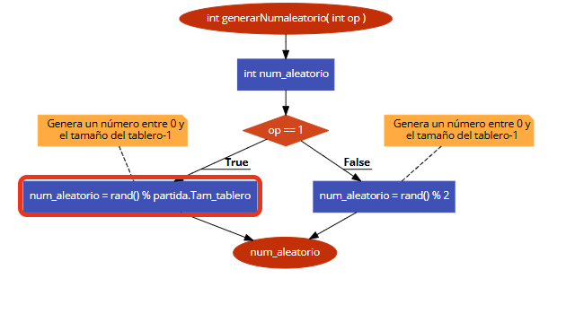
La complejidad por cualquier función viene dada por:
C = Nº aristas - nº nodos + 2
C = Nº nodos predicados + 1
Por lo tanto, en el caso de esta función:
C = 6 - 6 + 2 = 2
C = 1 + 1 = 2
Las rutas posibles son:

| Rutas | Secuencias de aristas |
--------|---------------|
| 1 | 1 → 2 → 3 → 4 |
| 1 | 1 → 2 → 5 → 6 |
  - Prueba de caja negra:

La función **generarNumaleatorio(int op)** devuelve un número aleatorio dependiendo del valor de la variable **op**. Si **op** = 1, la función devuelve un número aleatorio que comprenderá del 0 hasta **partida.Tam_tablero - 1**, que es coherente con un rango al estar referido a un tamaño de tablero. Esto se logra utilizando la función rand() y el símbolo %, quien calcula el resto de dividir al número aleatorio habido por la valor de **partida.Tam_tablero**. Si **op** es distinto de 1, la función devuelve un número aleatorio entre 0 y 1 mediante nuevamente **rand()** y el operador **%** con el número 2 como divisor, limitando el resultado a 0 o 1. Finalmente, el número aleatorio generado se guarda en la variable **num_aleatorio**, que luego se devuelve por la función.

**Módulo load**

- Procedimiento **inicializarTiposBarcos()**:
  - Prueba de caja blanca:
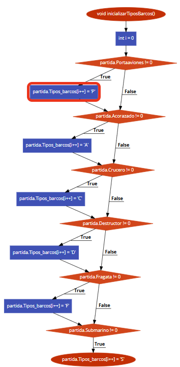

La complejidad por cualquier función viene dada por:
C = Nº aristas - nº nodos + 2
C = Nº nodos predicados + 1
Por lo tanto, en el caso de esta función:
C = 19 - 14 + 2 = 7
C = 6 + 1 = 7
Las rutas posibles son:

| Rutas | Secuencias de aristas |
--------|---------------|
| 1 | 1 → 2 → 3 |
| 2 | 1 → 2 → 5 → 6 |
| 3 | 1 → 2 → 5 → 8 → 9 |
| 4 | 1 → 2 → 5 → 8 → 11 → 12 |
| 5 | 1 → 2 → 5 → 8 → 11 → 14 → 15|
| 6 | 1 → 2 → 5 → 8 → 11 → 14 → 17 → 18 → 19 |

  - Prueba de caja negra:

Esta función verifica la agregación de los barcos correctos al array Tipos_barcos según los valores de las variables Portaaviones, Acorazado, Crucero, Destructor, Fragata y Submarino de la estructura partida.

Se pueden dar diversas opciones:

- Entrada: partida.Portaaviones = 1, partida.Acorazado = 0, partida.Crucero = 0, partida.Destructor = 0, partida.Fragata = 0, partida.Submarino = 0

  - Resultado Esperado: Tipos_barcos = ['P'] (solo Portaaviones).

- Entrada: partida.Portaaviones = 1, partida.Acorazado = 1, partida.Crucero = 0, partida.Destructor = 0, partida.Fragata = 0, partida.Submarino = 0

  - Resultado Esperado: Tipos_barcos = ['P', 'A'] (Portaaviones y Acorazado).

- Entrada: partida.Portaaviones = 1, partida.Acorazado = 1, partida.Crucero = 1, partida.Destructor = 0, partida.Fragata = 0, partida.Submarino = 0

  - Resultado Esperado: Tipos_barcos = ['P', 'A', 'C'] (Portaaviones, Acorazado y Crucero).

- Entrada: partida.Portaaviones = 1, partida.Acorazado = 1, partida.Crucero = 1, partida.Destructor = 1, partida.Fragata = 0, partida.Submarino = 0

  - Resultado Esperado: Tipos_barcos = ['P', 'A', 'C', 'D'] (Portaaviones, Acorazado, Crucero y Destructor).

- Entrada: partida.Portaaviones = 1, partida.Acorazado = 1, partida.Crucero = 1, partida.Destructor = 1, partida.Fragata = 1, partida.Submarino = 0

  - Resultado Esperado: Tipos_barcos = ['P', 'A', 'C', 'D', 'F'] (Portaaviones, Acorazado, Crucero, Destructor y Fragata).

- Entrada: partida.Portaaviones = 1, partida.Acorazado = 1, partida.Crucero = 1, partida.Destructor = 1, partida.Fragata = 1, partida.Submarino = 1

  - Resultado Esperado: Tipos_barcos = ['P', 'A', 'C', 'D', 'F', 'S'] (todos los barcos).

- Entrada: partida.Portaaviones = 0, partida.Acorazado = 0, partida.Crucero = 0, partida.Destructor = 0, partida.Fragata = 0, partida.Submarino = 0

  - Resultado Esperado: Tipos_barcos = [] (ningún barco).

### Plan de pruebas de aceptación

Para realizar el plan de pruebas de aceptación nos hemos centrado en unos criterios que ahora escribiremos y finalmente realizado una tabla resumiendo los objetivos que teníamos en mente y como se han cumplido al final.

Cabe destacar que este mítico juego está pensado para un público de todas las edades, y cualquier usuario puede disfrutar de la experiencia

1. Criterios de aceptación

El sistema se considerará aceptado si cumple con los siguientes criterios:

- ✅ Todas las funcionalidades funcionan sin errores.
- ✅ La información mostrada al usuario es clara y coherente.
- ✅ Los datos se guardan correctamente (si aplica).
- ✅ La interfaz es adecuada y comprensible para todo tipo de usuario.

2. Casos de prueba

| Módulo | Funcionalidad | Pasos | Resultado Esperado | Aprobado |
--------|---------------|-------|---------------------|----------|
| interfaces.c | Mostrar menús | Iniciar el juego | Menú con opciones visibles y seleccionables | ✅ |
| load.c | Cargar y guardar configuración | No hay que tocar nada del programa. | Se cargan correctamente los parámetros guardados y se guardan | ✅ |
| configuracion.c | Se configura todos los requisitos previos a el juego | Accedemos al menú configuración de interfaces y ahí configuramos el juego | Se guarda bien dicha configuración para posteriormente jugar con ella | ✅ | 
| juego.c | Iniciar partida | Seleccionar “Jugar Partida” y jugar | El juego se ejecuta correctamente, se genera bien el tablero, se detectan disparos, hundimientos, y turnos | ✅ |


# Documentación del código fuente

La documentación del código fuente se encuentra en la carpeta del trabajo. La ruta es la siguiente para acceder: `C:${workspaceFolder}\TrabajoMP24-25\Documentacion\html>`. Dentro de la carpeta `html` encontramos un archivo `index.html` que al abrirlo encontraremos todo tipo de detalle de la documentación del código fuente generado con **Doxygen**.


# Referencias {-}

* [GitHub](https://github.com/)
* [Code2flow](https://code2flow.com/)
* [ChatGPT](https://chatgpt.com/)
* [Excalidraw](https://excalidraw.com/)
* [Stackoverflow](https://stackoverflow.com/questions)
* [Doxygen](https://www.doxygen.nl/)